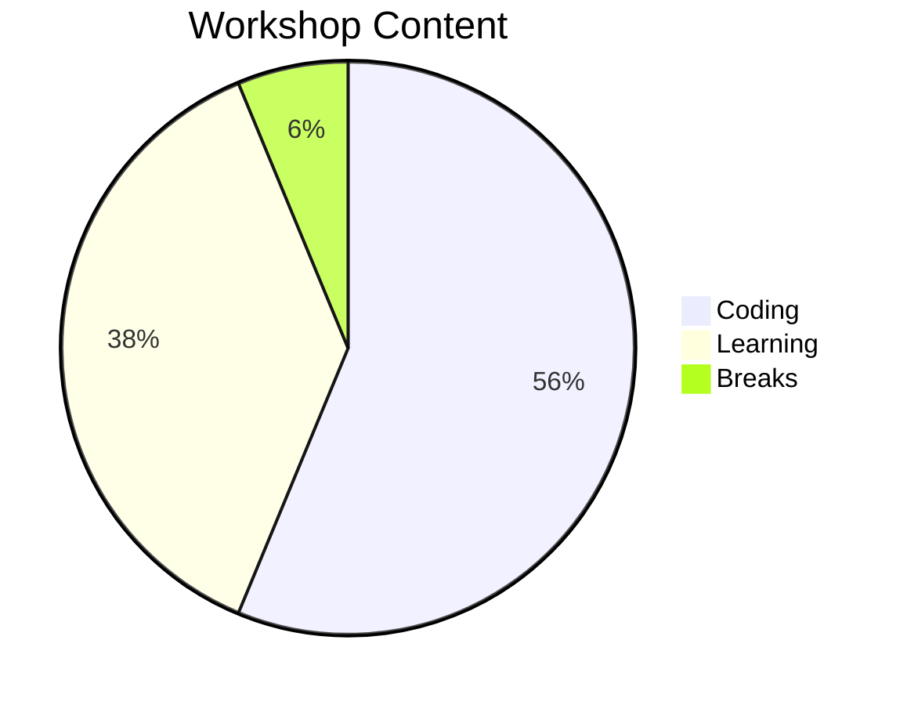

# Fast API Workshop

## Workshop Coverage

> Topics and content might not follow listing order

- WHY YOU API?
- First Steps
  - Requirments
  - Hello API
  - Hands On (there will be many!)
- Parameters / Input
  - Url Parameters
  - Query Parameters
  - Body
  - Parameter Types
  - Validation
- Pydantic Models
- OpenAPI
  - Annotation / flow-in
  - Swagger
  - reDoc
- Bigger Projects
  - Structuring Project
  - Routing
  - Prefix
- Error Handling
  - Exceptions
  - HTTP status
  - Customization
  - "Middleware"
- Database Backend
  - Accessing MongoDB
  - The Model / Document differences
