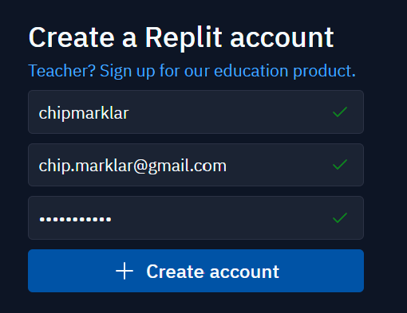

# Getting Started

## Set up Replit

1. Go to <https://replit.com/>
1. Navigate to signup. Click on the "Sign UP" button on the top right.
1. Create a Replit acocunt.   You may can one of the SSO providers, or create a Replit only user.
1. Once an account is created, Replit wants to help you learn about Replit. You can skip each screen, until you get to Replit's logged-in home screen [Logged In](https://replit.com/~)
1. Click the **"+ Create"** button on the left side bar. In the **"Create a Repl"** dialog:
    - Choose **Python 3.10** as the template.
    - Let Replit name your first Repl (random name) or provide your own. This name will become part of a public url, associated to your Replit account.

A new `main.py` file is created. It has code in it.
Click the **RUN** button on top. Observe that the application works.

Replace the content inside `main.py` with the code below.

```python
from fastapi import FastAPI
import uvicorn

api = FastAPI()


@api.get("/")
async def root():
    return "Hi."


# Manual entry point
if __name__ == '__main__':
    """Entry point to activate uvicorn"""
    uvicorn.run("main:api", host="0.0.0.0", port=8000)
```

This will cause replit to auto-install fastapi and uvicorn packages. It may take a minute or two, just wait for it to complete. During that time, the console may show messages such as:

> Replit: Updating package configuration

After package update is complete, open the file `pyproject.toml`. Ensure that the `fastapi` and `uvicorn` are listed (the last two) under the `[tool.poetry.dependencies]` section.

Now click the green **[Run]** button at the top.

> The **Webview** tab should open, showing the response `"Hi"` (Including quotation marks)

## Watch for Changes

1. Change the message from "Hi" to "Hello".
1. Reload the webview (hit the refresh spinny button)
    > Nothing changes with the message. This is because the server is running on a static view of the code
1. Change the call `uvirorn.run()` function parameters: add the parameter `reload=True` right after the port number (don't forget the comma).
1. Click the **[Stop]** button
1. Click the **[Start]** button
    > The Console tab should show a line statinga message _"Starged reloader process [....] using WatchFiles"_ (exact process ID will vary)
    > The message should now show "Hello"
1. Change the message to say "Howdie". Do not hit Stop/Start
    > The message should now refresh to "Howdie" in a few seconds.
    > The Console tab would reflect a re-load happened.

----

## Takehome

- Import FastAPI
- Create an instance of FastAPI by using the constructor
- Decorate a method to define an HTTP API endpoint using the `@api.get([path])` method
- Use uvicorn's `reload` parameter to ease development
